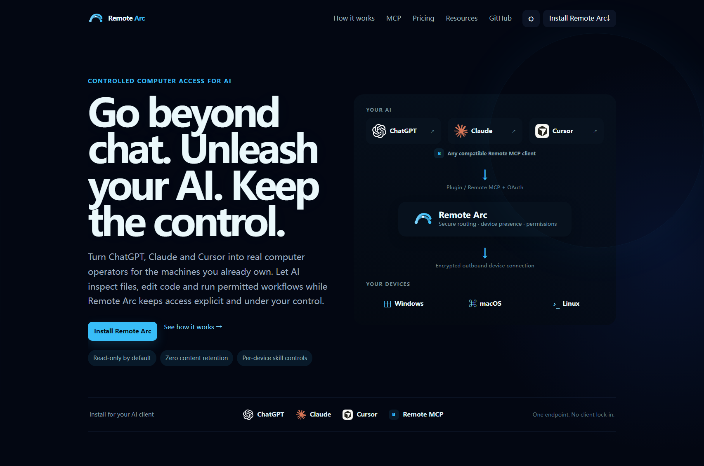
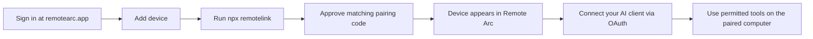
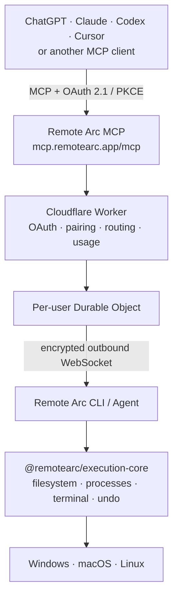

<div align="center">


# Remote Arc

**Controlled remote computer access for AI — across the computers you already own.**

Remote Arc connects ChatGPT, Claude, Codex, Cursor, and compatible MCP clients to Windows, macOS, and Linux computers you explicitly pair — without exposing a public port or requiring a VPN. It focuses on permissioned file, process, terminal, and explicitly shared browser access. Deterministic background tasks can persist independently of a chat; continuous AI reasoning is not currently claimed as a production capability.

[Website](https://remotearc.app) · [Dashboard](https://mcp.remotearc.app) · [Remote MCP](https://mcp.remotearc.app/mcp) · [Security](./SECURITY.md)

[](https://m8ven.ai/mcp/yaohuangguan/remote-arc)

</div>

<p align="center">
  <a href="https://remotearc.app">
    
  </a>
</p>

## Why Remote Arc

- **Durable deterministic tasks** — approved commands, schedules, and condition watches can continue beyond one chat turn and be inspected later; new AI judgment still requires an active reasoning host.
- **Read-only by default** — newly paired devices start with safe inspection capabilities.
- **Per-device skill controls** — independently enable file edits, terminal execution, process controls, and recovery.
- **Outbound-only connectivity** — no public IP, VPN, router port forwarding, or inbound listener on your computer.
- **Local safety boundaries** — Trusted Write Locations, boundary approvals, protected sensitive paths, local undo, and a terminal Safety Guard.
- **Open MCP interoperability** — one OAuth-protected Remote MCP endpoint for supported AI clients.
- **Native execution core** — Remote Arc owns its filesystem, process, and terminal execution path rather than proxying another computer-control MCP server.

## Quick start

Connect a Windows, macOS, or Linux computer:

```bash
npx remotelink
```

Then connect your MCP client to:

```text
https://mcp.remotearc.app/mcp
```

The browser pairing flow binds that computer to your Remote Arc account. From there, your AI client can only use capabilities currently allowed for that specific device.

## User flow



## Architecture



The hosted relay authenticates and routes requests. OS-level operations execute on the paired device, subject to the device's saved tool policy and local safety controls.

## Monorepo

```text
remote-arc/
|
+-- apps/
|   +-- ui/              React dashboard and pairing UI
|   +-- relay/           Cloudflare Worker, OAuth, D1, Durable Objects, MCP
|   +-- agent/           Device agent runtime using the native execution core
|   +-- mcp/             Thin local MCP adapter for development/testing
|
+-- packages/
    +-- cli/             Published `remotelink` npm CLI
    +-- execution-core/  Native Remote Arc filesystem/process/terminal core
    +-- protocol/        Shared agent/relay message types
```

There is only one local execution implementation:
`@remotearc/execution-core`.

`apps/mcp` is a protocol adapter, not a separate execution backend.

## Native execution core

Remote Arc implements its local computer capabilities directly with Node and OS
APIs.

Current native tools:

```text
list_directory
browse_directories
read_file
read_binary_file
get_file_info
list_processes
write_file
edit_block
list_undo_actions
undo_change
undo_last_change
start_process
process_status
process_output
list_managed_processes
stop_process
```

The implementation uses standard Node primitives such as:

```text
node:fs
node:path
node:child_process
node:os
```

This keeps Remote Arc's execution behavior, safety model, release cadence, and
supply chain under Remote Arc's control.

## Permission model

New devices start with the Safe preset.

### Safe

Read-only local capabilities:

```text
list_directory
read_file
read_binary_file
get_file_info
list_processes
```

The native core also has internal dashboard capabilities such as
`list_undo_actions` and `browse_directories`. They let the authenticated
Remote Arc dashboard load local recovery metadata and browse selectable folders
without turning those controls into normal hosted AI skills.

### Developer

Safe plus reversible file editing:

```text
write_file
edit_block
undo_last_change
```

The dashboard can additionally invoke the internal `undo_change` operation to
restore a selected local snapshot.

Developer mode does **not** include arbitrary terminal execution.

### Full

Developer plus:

```text
start_process
process_status
process_output
stop_process
```

`start_process` can run synchronously or return a local process handle for a
managed background process. Output and status stay on the device and are read
through the same authenticated Remote Arc tool path. The dashboard uses the
internal `list_managed_processes` capability to show these Remote Arc-managed
jobs and lets the user inspect output or stop a running process.

Presets are shortcuts. The actual hosted policy is an individually editable
per-device skill list.

## Durable Automations

Remote Arc can persist deterministic work independently of the chat session that created it. MCP clients need the separate `automation:read` / `automation:write` OAuth scopes to inspect or create persistent work; ordinary `computer:write` access does not grant that authority.

Four production task modes share the same durable task engine:

- **Long task** — start a command and keep tracking it after the MCP call/chat ends.
- **Condition watch** — wait for a webhook event, then execute an approved plan.
- **Schedule watch** — execute a plan on a recurring interval or at a future time.
- **Goal loop** — repeat a fixed work plan, execute a verification command, and retry until verification succeeds, the task expires, the run limit is reached, or the user stops it.

Condition watches may also use a cloud-side GitHub App merge action. A matching CI webhook can therefore merge an explicitly configured pull request without depending on a paired computer being online.

Automation state lives in D1 and is advanced by the Worker scheduler or webhook events. Device execution still goes through the same authenticated Durable Object route and the device's existing skill/path policy.

Creating an automation snapshots the current device permission policy. Routine disconnects and local agent restarts do not introduce an approval step: unattended work waits for the device and automatically recovers. If you later change the device security policy itself, Remote Arc stops that automation rather than silently inheriting a different trust boundary.

A device going offline moves eligible work to `waiting_for_device`; it does not automatically fail the automation. Deterministic long-running work defaults to automatic attempt restart if the local agent reconnects without its previous managed-process handle. If a task needs fresh AI judgment after a result changes, that reasoning must come from a currently available AI host; Remote Arc does not currently claim an autonomous ordinary-Chat wake loop.

The background agent and automation engine solve different problems:

- the background agent keeps a paired device available and reconnecting without an open terminal window;
- the automation engine preserves task state and triggers independently of an MCP request or chat lifetime.

A sleeping, powered-off, or disconnected computer is not considered online. Device-backed work resumes only after the agent reconnects.

Running:

```bash
npx remotelink --safe
```

adds a local hard read-only cap that the dashboard cannot expand.

## Local Undo

Before supported `write_file` and `edit_block` operations, Remote Arc stores
the previous file state locally under:

```text
~/.remotearc/undo
```

Properties:

- snapshots stay on the device
- snapshots are not uploaded to Remote Arc Cloud
- snapshots expire after 7 days
- the local store is capped at 200 MB
- individual files larger than 20 MB are not snapshotted
- undo verifies the post-edit file hash before restoring
- if a file changed again afterward, automatic undo refuses to overwrite it

Local Undo cannot reverse external side effects such as deployments, package
publishing, network requests, or remote database mutations.

The dashboard can load undo metadata directly from an online device on demand
and restore a specific action. Each row reports whether the current file still
matches the recorded post-edit state. Conflicted, missing, or legacy snapshots
are shown as unavailable instead of attempting an unsafe overwrite. Undo history
is not persisted in D1 or another Remote Arc cloud store.

## Sensitive Path Policy

Sensitive-path protection is enabled by default in the native execution core.

Built-in protected locations include common credential and profile areas such
as:

```text
~/.ssh
~/.aws
~/.gnupg
~/.azure
~/.kube
~/.docker
~/.config/gcloud
browser profile directories
.env and .env.*
```

Users can add additional protected paths per device in the dashboard. When a
specific project genuinely needs a protected file such as one `.env`, users can
add a narrow sensitive-path exception for that exact file or directory without
turning off protection globally. A sensitive-path exception grants visibility
only; it does not create write authority outside Trusted Write Locations.

Path checks happen again on the local device immediately before filesystem
execution. Canonical-path checks prevent a symlink inside a trusted write
location from turning a permitted mutation into an out-of-scope write.

The selected trusted-write/protected-path strings are control-plane policy
metadata stored in D1; saving a path does not copy its file contents. Durable
deterministic Tasks store only the task contract, bounded run state and result
metadata needed for their lifecycle.

## Trusted Write Locations and boundary approvals

A device can define one or more Trusted Write Locations. These are the folders
where supported file mutations may happen repeatedly without asking for a new
approval every time. The dashboard supports manual path entry and a
device-backed directory picker.

Trusted Write Locations are deliberately **not** the AI's visible world.
Read-only filesystem tools may inspect ordinary non-sensitive files outside
those locations. Supported mutations such as `write_file` and `edit_block`
must stay inside a Trusted Write Location or receive a narrowly scoped boundary
approval before execution.

An out-of-scope write can be approved once, allowed briefly for the same
file/tool, promoted by trusting the parent folder, or denied. One-shot approvals
are consumed after successful execution. Approval metadata is bound to the
account, device, OAuth client/grant, tool, target path and request details.

For Full mode, `start_process` remains a separate high-risk capability. When
Trusted Write Locations exist, terminal calls require an in-scope `cwd`, but
that check is **not** an operating-system sandbox: a shell running from an
allowed directory may still reference other paths, credentials, network
services or child processes.

## Native-core reliability

File rewrites and targeted `edit_block` changes use same-directory temporary
files followed by rename, reducing the risk of leaving partially written files
after an interrupted write. Append mode remains append semantics and is not
described as an atomic rewrite.

## Safety Guard

Terminal execution is available only when the device policy allows
`start_process`.

Before a terminal command runs, the native execution core blocks a narrow set
of clearly catastrophic patterns such as:

- recursive deletion of root/home paths
- disk formatting
- raw-disk overwrite
- fork bombs
- machine shutdown/reboot

The Safety Guard is defense in depth, not a complete OS sandbox.

## Authentication and trust boundaries

Remote Arc separates four identities:

1. dashboard user
2. MCP client
3. paired device
4. live device connection

### Dashboard

Users sign in with Google. The Worker creates a secure HTTP-only session.

### MCP client

Remote MCP uses OAuth 2.1 authorization code flow with PKCE and dynamic client
registration. The Security dashboard tracks each OAuth authorization instance
separately and labels it as active, refreshable, or expired. Revoking one grant
invalidates that client authorization without revoking paired computers or
other AI-client grants.

Discovery:

```text
/.well-known/oauth-protected-resource
/.well-known/oauth-authorization-server
```

OAuth endpoints:

```text
/oauth/register
/oauth/authorize
/oauth/token
```

### Device

Every paired device receives its own revocable credential.

The raw device credential is stored locally in:

```text
~/.remotearc/config.json
```

The hosted database stores only its SHA-256 hash.

### Routing

Live devices connect outbound over WebSocket to a per-user Durable Object.
Remote Arc does not require inbound access to the computer.

## Cloudflare deployment

Production:

```text
Website: https://remotearc.app
MCP:     https://mcp.remotearc.app/mcp
Health:  https://mcp.remotearc.app/health
```

The hosted architecture currently uses:

- Cloudflare Workers
- Workers Static Assets
- per-user Durable Objects
- D1 for control-plane state
- outbound device WebSockets

Static JS/CSS/assets bypass the Worker runtime so normal website traffic does
not unnecessarily consume the Workers request quota.

Production deploys are intentionally single-path: a successful CI run on
`master` triggers `.github/workflows/deploy-cloudflare.yml`, which is the normal
way production is updated. Local `pnpm deploy:relay` is blocked to prevent a
second Wrangler deploy racing the CI deployment. For an emergency-only manual
production deploy, use:

```bash
REMOTEARC_MANUAL_PROD_DEPLOY=1 pnpm deploy:relay
```

Every allowed deploy writes the verified Git SHA into the Cloudflare version tag
and message so production history can be traced back to its source commit.

## Remote MCP tools

Hosted MCP currently exposes 31 user-facing tools. Device-execution tools are still filtered by the selected device's policy and live capabilities:

```text
list_devices
device_tools

browser_list_tabs
browser_get_current_tab
browser_read_page
browser_get_selected_text
browser_extract_links
browser_extract_table
browser_click
browser_fill

list_directory
read_file
read_binary_file
create_file_resource
revoke_file_resource
get_file_info
list_processes
start_process
process_status
process_output
stop_process
write_file
edit_block
undo_last_change

create_automation
list_automations
get_automation
manage_automation
```

The automation tools create and manage durable deterministic control-plane state. They do not grant new device capabilities: when an automation executes on a computer, the normal device ownership, skill policy, Trusted Write Locations, boundary approvals and Sensitive Path Policy checks still apply. Per-device task permissions independently govern background, scheduled and keep-awake behavior.

Adaptive Agent Goal/source-decision work remains an experimental implementation behind a disabled production feature flag. It is intentionally absent from the shipped MCP tool contract because ordinary Chat cannot yet be autonomously woken for fresh reasoning after the creating turn ends. The engineering notes remain in the repository for continued research.

See [the complete system architecture](docs/system-architecture.md),
[implementation plan](docs/long-running-work-plan.md),
[resume checkpoint](docs/long-running-work-progress.md) and the website guide
at `/docs/long-running-work`. Real Plugin/Chat/Work overnight acceptance remains
pending. Local Wrangler tests prove relay execution/recovery, not host lifetime.

Before a device call is forwarded, the relay verifies:

- authenticated MCP user
- device ownership
- device revocation state
- saved per-device skill policy
- currently advertised device tools

## Development

Requirements:

- Node.js 24+ for development and the SQLite test suite (device CLI: Node.js 20+)
- pnpm 10
- Cloudflare Wrangler for relay work

Install:

```bash
git clone https://github.com/yaohuangguan/remote-arc.git
cd remote-arc
pnpm install
pnpm run ci
```

Useful commands:

```bash
pnpm dev:mcp
pnpm dev:agent
pnpm dev:relay
pnpm dev:ui

pnpm build:cli
pnpm build:ui
pnpm test:deploy-policy
# production deploys run automatically after CI on master
```

Run only the native execution-core integration test:

```bash
pnpm --filter @remotearc/execution-core test:integration
```

The GitHub CI matrix runs native-core integration and MCP adapter smoke tests
on:

```text
Ubuntu
Windows
macOS
```

## Publishing the CLI

The npm package name is:

```text
remotelink
```

Product name:

```text
Remote Arc
```

The package also exposes these CLI aliases:

```text
remotelink
remote-link
remote-arc
```

The published CLI bundles `@remotearc/execution-core` into the distributable
artifact. End users do not install a separate execution server.

Release content has one source of truth: `CHANGELOG.md`. Each release section uses
`## <version> - <date>`, one `### <title>`, and bullet changes. Run:

```bash
pnpm release:sync
pnpm release:check
```

`release:sync` updates the npm README's Latest release block. The website Releases
page reads the same CHANGELOG at build time, and the GitHub Release workflow uses
the same section as its release notes. CI fails when the package version and latest
CHANGELOG section drift apart.

npm publishing uses GitHub Actions OIDC Trusted Publishing with provenance.

The npm Trusted Publisher configuration must match:

```text
Organization or user: yaohuangguan
Repository:           remote-arc
Workflow filename:    publish-remotelink.yml
Environment name:     production
Allowed action:       npm publish
```

## Security model

Remote computer access is high impact. Remote Arc therefore starts from a
restricted capability model instead of granting unrestricted terminal access.


Current protections include:

- read-only default preset
- individually editable device skills
- local hard Safe mode
- per-device credentials
- hashed device credentials in D1
- OAuth 2.1 + PKCE
- per-user Durable Object routing
- revoked-device checks before MCP forwarding
- outbound-only device connections
- Local Undo for supported file changes
- on-demand Local Undo history from the device
- Sensitive Path Policy enabled by default
- configurable Trusted Write Locations and boundary approvals
- canonical/symlink-safe filesystem path enforcement
- atomic rewrite/edit operations
- local Safety Guard for catastrophic terminal commands
- no Desktop Commander dependency

Still planned before broader public use:

- stronger secret redaction in audit metadata
- more granular command/network policy
- signed/notarized installers
- background service / auto-start
- auto-update

## Roadmap

### Phase 1 - core platform

- [x] Cloudflare relay
- [x] D1 identity/device/OAuth model
- [x] per-user Durable Object routing
- [x] Google sign-in
- [x] OAuth 2.1 + PKCE Remote MCP
- [x] browser-approved device pairing
- [x] one-command `remotelink` CLI
- [x] per-device skill management
- [x] Safe / Developer / Full presets
- [x] Local Undo
- [x] targeted Local Undo history UI
- [x] Sensitive Path Policy
- [x] Trusted Write Locations + boundary approvals
- [x] atomic file rewrites
- [x] Safety Guard
- [x] native Remote Arc execution core
- [x] remove Desktop Commander dependency
- [x] Windows/macOS/Linux CI
- [x] production relay deployment
- [x] publish native-core CLI to npm

### Phase 2 - local security and reliability

- process handles and background jobs
- streaming command output
- richer Windows/macOS/Linux process support
- signed/notarized installers
- background service / tray/menu-bar agent
- auto-update

### Phase 3 - public product

- broader multi-user security review
- improved audit history
- organization administration
- public ChatGPT integration/discovery
- production observability and abuse controls

## License

Remote Arc is **source-available, not open source** for current releases.

The current source is licensed under the
[Remote Arc Proprietary Source License](./LICENSE). Viewing and security review
are permitted, but modification, redistribution, white-labeling, and commercial
exploitation require written permission.

Historical revisions previously released under MIT remain governed by the MIT
terms that applied to those revisions.

Third-party components continue to use their own licenses.
