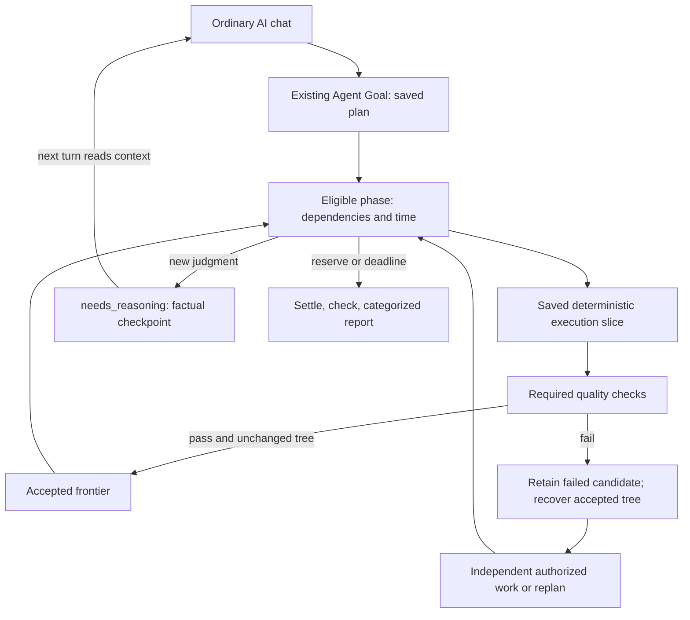

# Planned Agent Goals: durable work from ordinary AI chat

Engineering reference for Draft PR55, stacked on PR44. This is branch behavior,
not a production release. Release HOLD remains; real Chat overnight/event-wakeup
acceptance is pending. See the implementation plan and progress log for resumption.

## Conversation, controller and execution

The user keeps their existing AI chat. With authorization, that client saves an
Agent Goal and plan before significant execution. Remote Arc operates the paired
computer under existing account/OAuth/device permissions and frozen tool/path
policy. Dashboard is optional for creation and useful for inspection/pause/cancel.

Normal Chat is the initial source UX. The durable goal outlives a bounded source
response. Saved deterministic command slices proceed while the source is absent;
unplanned judgment waits in `needs_reasoning`. A later turn reads `get_goal_context`
and resumes from factual state without replaying the conversation. No hosted AI
is silently substituted. The explicit hosted controller still uses the existing
bounded Planner and provider retries.

`source_capabilities` records durable context, next-turn resume and optional
autonomous event wakeup. It is descriptive, not proof or permission for wakeup.
Default wakeup is false. Verified events remain optional and require existing
secure egress/encrypted-key setup. Only real host acceptance proves autonomous
resumption. Work, Codex and other MCP clients share this capability-based protocol.



## Additive contract

No second engine/registry/Mission, D1 migration or OAuth scope. Existing Agent
Goal `goal_loop` rows gain optional `plan` in `goal_json` and versioned `planned`
in `state_json`. Legacy single goals retain their path and hosted default.

Example `create_agent_goal` MCP arguments:

```json
{
  "name": "Validate the project while I am away",
  "device_id": "paired-device-id",
  "controller": "source",
  "objective": "Improve the project without weakening acceptance checks",
  "success_criteria": "Each accepted change passes required checks",
  "workspace": "/work/project",
  "allowed_tools": ["read_file", "edit_block", "start_process"],
  "max_iterations": 80,
  "source_capabilities": {
    "durable_context": true,
    "resume_on_next_turn": true,
    "autonomous_event_wakeup": false
  },
  "plan": {
    "planning_mode": "guided",
    "priorities": ["Fix verified regressions", "Improve an independent component"],
    "phases": [],
    "time_policy": {
      "min_duration_seconds": 14400,
      "max_duration_seconds": 28800,
      "finalization_reserve_seconds": 300
    },
    "quality_policy": {
      "promotion": "green_only",
      "required_checks": [
        { "name": "typecheck", "command": "pnpm typecheck", "timeout_seconds": 300 },
        { "name": "tests", "command": "pnpm test", "timeout_seconds": 600 }
      ],
      "rollback_on_regression": true
    },
    "recovery_policy": {
      "same_failure_limit": 3,
      "no_progress_iteration_limit": 8,
      "max_strategy_retries": 2
    },
    "continuation": { "mode": "highest_value_safe_work" }
  }
}
```

The selected source/hosted controller proposes the guided/autonomous initial plan.
Fixed mode requires supplied phases. A phase has stable ID, objective, criteria,
dependencies, optional min/max durations, verify command/cwd and optional saved
`execution_slice` of up to eight named commands. Only completed prerequisites
permit downstream execution. Outcomes completed/partial/blocked/failed/skipped
record timestamps, wall/execution durations, evidence, remaining work, blocker and
checkpoint. Early completion advances eligible work without artificial waiting.

## Time, progress and revisable plans

The earliest maximum, absolute `end_at` or task expiry bounds effects. `end_at`
requires an ISO timezone offset; optional IANA timezone is metadata, not a calendar
or DST scheduler. Reserve enters finalization before the hard end. Source waits
retain due phase/deadline alarms. Check time before planning and immediately before
effects. Managed commands receive a device-side duration timer plus relay checks.
A live CLI terminates the tracked tree on timeout. Lost handles after CLI restart
still need inspection; there is no reboot-persistent PID tracker or new OS service.

Minimum time invites useful verifiable work, never filler edits. Waiting for the
source does not count as recorded execution. Process time is telemetry, not proof
of useful engineering: the controller justifies additional work. No justified
safe candidate means a recorded wait or explicit safe finalization. Phase minima
do not require delaying already-complete work or running meaningless commands.

Revisions use existing revision CAS/idempotency receipts. `revise_plan` replaces
unfinished phases with an operational reason; settled IDs/outcomes remain and
cannot be reused. Settle the active phase first. Revisions cannot expand tools,
controller, quality policy or time authority. Early completion, exhausted budgets,
blocked dependencies, regressions, stuck strategies and changed time create replan
reasons. Equivalent failures and no-progress turns are counted durably. Recovery
parks work or requests a different strategy. Repeated attempts at the same recorded
objective are capped by the strategy retry policy; overall iteration/revision
limits remain hard bounds.

Adaptive revisions require prior `highest_value_safe_work` authorization. Candidate
`selection` carries value/risk/confidence (0–100; value/confidence positive), effort
in seconds and justification. Satisfied dependencies, deterministic verification
and remaining safe time gate feasibility. Value × confidence / (1 + risk) ranks
feasible candidates; only one becomes a bounded sub-phase. These are controller
assessments, not locally fabricated reasoning. Inspection uses bounded file reads.

## Quality frontier and safe local checkpoints

`green_only` requires terminal authority, configured checks, clean Git repository
root and updated CLI advertising private `goal_workspace`. Each run receives a
task-owned detached worktree under `.remotearc-goals`. Baseline failure records that
there is no verified green baseline; retain the original commit and inspect/fix in
isolation. Dependencies may need explicit preparation in the candidate; untracked
node_modules/build artifacts are not automatically copied from the user's checkout.

Tests/typecheck/build/benchmarks/invariants share bounded named command checks.
Stop on first required failure. File tools additionally enforce a canonical
task-root constraint, including symlink checks, alongside device policy. Shell
commands use the isolated cwd and local OS account; this is not an OS sandbox.

Fingerprint the candidate Git tree before checks. Promotion requires the same tree
after checks, then records a detached `commit-tree` checkpoint without hooks or
signing. User branch/index are untouched. Only passing required checks advance the
durable frontier. Failed evaluation leaves it unchanged. With rollback enabled,
create a fresh worktree from the accepted frontier and retain the failed worktree.
No reset/clean/recursive deletion affects user work. Unproven ownership or unknown
effect/checkpoint acknowledgement stops automatic mutations for inspection.
On-device operation receipts support restart/idempotency; uncertain dispatch is
never blindly replayed. Accepted work is reviewed before explicitly applying to
the original branch. Retained worktrees consume disk and need intentional cleanup.

## Source decisions and factual handoff

### Chat and Dashboard refer to one saved task

The normal entrypoint is the existing AI conversation. For requested ongoing work,
the AI calls `create_agent_goal` (explicit `controller: "source"` to keep judgment
in that conversation) or `create_automation` for deterministic work. The user does
not need to fill a Dashboard form. Creation returns `automation.id` plus
`dashboard_url`, an authenticated `/automations?task=<id>` link. The AI retains
the ID in the conversation and shows the link; Dashboard filters and opens that
same durable record. Details provide a copyable chat reference, so a later turn
can read the checkpoint and resume when authorized. Names are not identity.

This is task identity, not an automatic binding to ChatGPT's private conversation
ID. One chat may create several tasks; a permitted source client can revisit a
task by ID from another turn/chat. Ownership and OAuth client binding remain the
authority. Remote Arc does not read the whole chat or create tasks merely because
an ordinary tool was used. If the host loses the reference, `list_automations`
can recover account-owned task IDs. A saved link/reference does not wake a model.
The existing hosted default remains for backwards compatibility; chat-controlled
goals explicitly select source and never silently switch controllers.

Legacy tool/complete/pause remain. Planned decisions add:

| Decision | `arguments_json` | Result |
| --- | --- | --- |
| `revise_plan` | `{phases,reason,adaptive?}` | Durable bounded revision |
| `execution_slice` | `{steps:[{name,command,cwd?,timeout_seconds}]}` | Save steps before execution |
| `phase_result` | `{outcome,remaining_work?,blocker?}` | Settle phase; completed still undergoes checks |
| `needs_reasoning` | `{}` | Preserve context; stop speculative work |

Use expected revision and a stable idempotency key. Complete/phase_result requires
factual evidence, including partial/blocked results. Duplicate acknowledgement
remains valid after phase transitions. Pending decision bodies clear on consumption
under existing leases. Source mode never falls back to Workers AI/OpenAI API.

Context contains plan/revisions/current phase/time, accepted frontier/candidate,
checks, local slice/process progress, observations/blockers, needs-reasoning reason,
next-safe-action class and bounded journal. Plan memory retains factual cross-phase
decisions/outcomes (12k chars); phase memory resets on transition. Private chain of
thought is never persisted. Bound plans to 24 phases/96k chars, 32 revisions, eight
commands per slice, 16 recent checks and 48 rejected attempts. Journal pagination
retains existing bounds. Task-content privacy rules still apply to this memory.

## Finalization, UI and verification

Reserve closes risky work, settles processes, preserves/rebuilds accepted state
where possible, runs configured final checks within the hard end, captures owned
worktree status when possible and saves a factual report. Distinguish accepted,
rejected, partial, blocked, failed, skipped and untouched work, final frontier/checks
and required reasoning. Offline/unavailable checks never count as passes. Task
`completed` can mean finalized: inspect outcomes; it does not assert every objective
passed. Hard expiry records incomplete work/unavailable checks before fencing
workers. Scheduled repeats start fresh per-run state/workspaces; absolute end time
bounds repeats. Keep-awake still needs both device permission and task opt-in.

Dashboard extends existing Automations with readable plan/time/phase/check/recovery
controls and outcome detail. Normal forms omit leases/revision internals. Users can
ask the AI to create these tasks instead of filling any Dashboard form.

Validation uses actual relay functions + SQLite, extended existing Wrangler/D1 +
WebSocket-device E2E and real local Git worktree/timeout checks. Parent tests retain
legacy source/hosted/scopes/lease/CAS/cancel/unknown/recurrence/retry/revocation/event/
power behavior. CI adds native worktree checks on Windows/macOS/Linux. These fixtures
do not prove Chat wakeup or a twenty-hour host run. Production migrations/deploy,
npm/release/tag/plugin publication and real-host overnight acceptance stay on HOLD.
