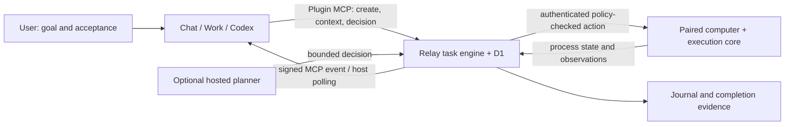

# Implementation plan: persistent goal-driven work

Status: accepted product direction; implementation started 2026-10-01.
Baseline: PR #43, `3ec08ca5b1c2646382737b6cbba23bc7c3749648`.
Implementation branch: `feat/goal-continuation`, based on
`feat/durable-automations`. Separate stacked draft PR requested by the user.

## 1. Product outcome and acceptance

A user supplies a bounded objective, a target computer, approved capabilities,
completion criteria and a deadline/iteration budget. The agent works for hours
without the user supplying continuation prompts: observe, decide, act, inspect
the result, change strategy when necessary, and verify the final outcome. The
user can sleep while the agent and target computer continue. A useful morning
result contains the outcome, evidence, changes and any remaining real blocker.

Time spent waiting for a process or event does not require continuous model
inference. Remote Arc persists the task and delivers the next observation when
work can proceed. A temporary disconnect/provider error is recoverable; an
unmet prerequisite or exhausted authorization is an explicit blocker. Passing
time alone is neither success nor permission to expand authority.

First real acceptance target: one genuine overnight task that includes at least
one failed check, an adapted action, and final evidence. An 8–12 hour window is
a test scenario, not a published runtime guarantee. A roughly 20 hour Codex
session is an experience reference, not a hard product SLA.

## 2. Entire PR #43 baseline

| Area | Already in the draft | Remaining work |
| --- | --- | --- |
| Device presence | login background service, outbound WebSocket reconnect, ping watchdog, pairing policy | task-scoped sleep prevention and real reconnect acceptance |
| Execution core | local file/process tools, managed processes, policy and undo boundary | durable action identity/recovery without blind replay |
| Relay | authenticated Durable Object routing, account/device/OAuth isolation | fenced task writes and action dispatch |
| Durable engine | D1 tasks/runs/webhook events, one-minute cron, long tasks, condition/schedule watches, deterministic goal loop | crash checkpoints, retry handling, controller continuation |
| Adaptive goals | compact working memory, six approved tools, hosted Workers AI or OpenAI planner | source-agent controller, durable handoff context, stronger completion evidence |
| GitHub action | installation-token-based cloud PR merge | user/repository authorization; fail closed until explicit binding exists |
| MCP/Plugin | create/list/get/manage tools, separate automation and agent scopes | context/decision protocol and authenticated event subscriptions |
| UI/site | automations dashboard, releases, existing Docs/security content | accurate formal architecture and practical overnight knowledge |
| Delivery | CI/build/native smoke tests and UI preview | failure-injection tests; actual Plugin/Chat/Work/device overnight test |

Keep these implementations and their identities. Do not introduce a second
device registry or task engine. Existing Long Task and deterministic Goal Loop
are distinct from a reasoning agent even when they run for a long time.

## 3. Controller architecture

The durable task owns its objective, approved tools, policy snapshot, trigger,
deadline, working memory, progress journal and execution state. The controller
supplies a next decision; Remote Arc owns dispatch and enforcement.

Controllers:

- **Source agent:** Work/Codex goal runtime or a Chat conversation subscribed to
  task events. The user's host keeps reasoning and submits bounded decisions.
- **Hosted planner:** existing configured Workers AI/OpenAI provider. This is an
  explicit alternative and may use a different model from the creating chat.

Do not silently switch controllers/models when a chat stops. Both controllers
use the same bounded decision validation and final verification. Persist a
factual handoff, not private chain-of-thought. Agent-needed is a machine-readable
continuation state; waiting for the user every morning is not the target flow.

## 4. Durable contract and continuation protocol

Persist objective, success criteria, workspace, approved tools, controller,
verification command where available, max planning iterations, expiry, trigger
and per-run identifiers. Add a monotonic revision for optimistic concurrency.

The source protocol must support:

1. Create a source-controlled goal without requiring a hosted model key.
2. Read bounded context: contract, revision, phase, current observation, memory,
   decision summary, completion evidence, run history and ordered journal.
3. Submit one validated next decision with the expected revision and an
   idempotency identifier. Reject stale revisions or duplicate conflicting
   decisions. Ordinary computer-write scope never grants this authority.
4. Execute only after a worker has the current lease and the original device
   policy still permits the action.
5. Checkpoint results and make the next context/event available. A reattached
   host can continue from this checkpoint rather than replaying the whole chat.

MCP names should extend the current tools rather than rename them:
`create_agent_goal`, `get_automation`, `get_goal_context`,
`submit_goal_decision`, `list_automations`, `manage_automation`.

The journal is append-only, sequenced and bounded on retrieval. Record creation,
decision, dispatch intent, outcome/uncertainty, wait/retry, verification and
termination. Do not persist unbounded raw process output or sensitive tool
arguments as a public event payload. Existing latest output_summary remains a
summary, never the only historical record.

## 5. Execution correctness and recovery

All worker writes are fenced by task ID, current lease token, unexpired lease,
active status and expiry. Renew/check the lease before actions. Pausing,
cancelling or expiring invalidates the lease; stale workers cannot resurrect the
task or clear a newer worker's lease. Fence run updates and journal/action
changes as well as the outer task row.

Persist dispatch intent before a side effect and checkpoint its bounded result
before the next planner action. A crash between dispatch and acknowledgement
creates an **unknown outcome**. Re-inspect before deciding what to do; do not
claim exactly-once shell or third-party effects without a verified deduplication
mechanism. Agent commands with lost handles must continue through inspection.
Deterministic restart/fail policy stays explicit, with honest documentation.

Provider timeouts, rate limits and transient upstream errors get bounded retry
with backoff. Validation/auth/policy errors fail or block with an actionable
reason. Retry preserves the latest checkpoint and never replays an uncertain
side effect. Stop on expiry, run/iteration limit, user cancel or genuine blocker.

GitHub cloud merge must bind the authenticated Remote Arc user to the allowed
installation/repository. A deployment-wide installation ID supplied by a
caller is not that binding. Until binding is implemented and tested, disable
multi-user cloud merge by default rather than rely on repository token scoping.

## 6. Chat events and Work/Codex continuation

Implement MCP Events discovery/list/subscribe/unsubscribe alongside existing
tools using the documented host protocol. A source host subscribes explicitly
to the task after the user requests background work. Events signal meaningful
changes (agent-needed, completed, blocked/failed); avoid perpetual unchanged
heartbeat notifications.

Subscriptions are account/OAuth-grant scoped and task scoped. Store callback,
expiry, event filters and signing material securely; require configured secret
encryption for persisted signing material. Only public HTTPS callbacks are
allowed in production; prevent local/private address access and redirects.
Use Standard Webhooks signatures, stable delivery IDs, durable outbox, bounded
retries, revocation/expiry and unsubscribe. Delivery acknowledgement means the
host received the event, not that reasoning ran or the goal completed.

Work/Codex can use the same context/decision tools inside a persistent goal.
Chat needs verified event-triggered continuation; the plugin alone does not
extend a normal turn indefinitely. Host account/model availability, quotas and
autonomy limits remain host responsibilities. Keep the real host test pending
until observed. Sources:

- https://learn.chatgpt.com/use-cases/follow-goals
- https://learn.chatgpt.com/docs/prompting
- https://learn.chatgpt.com/docs/long-running-work
- https://developers.openai.com/plugins/build/mcp-events

## 7. Scheduling and device availability

Long, overnight and scheduled goals use the same execution loop. Add future
one-shot and recurring triggers to Agent Goal creation. Each recurring run
starts fresh run state and its own iteration count/evidence; never overlap
instances of the same task. Preserve the current completion-relative interval
semantics and document them. Calendar cron/timezone/DST and missed-run policies
are a separate extension, not an implied existing capability.

Provide explicit task-scoped keep-awake behavior on supported systems, with a
bounded renewable lease and cleanup on cancellation/completion or disconnect.
Do not permanently change OS power settings. Background at-login service does
not itself prevent sleep or run when the computer is powered off. Credential
revocation and policy changes remain final enforcement boundaries.

## 8. Completion and reporting

A complete decision must provide concrete evidence. When a deterministic
verifier is configured, it must succeed; failed verification returns the
observation to the controller for a revised plan. A goal without a verifier
must be clearly identified as controller-attested completion, not independent
proof. Capture completion evidence and the verification result in the journal.

The morning report includes objective, status, attempts/iterations, relevant
changes, verification evidence and unresolved blockers. Logs remain available
for another host to reattach. The public UI should explain these outcomes in
user language and link to Docs without leaking lease/protocol internals into
routine task creation.

## 9. Formal documentation and website

Maintain three sources with different audiences:

- This plan: design decisions, sequencing, review findings and implementation.
- `docs/system-architecture.md`: formal reference for the complete system,
  trust boundaries, capability matrix, lifecycle, APIs, storage and limitations.
- Website `/docs`: bilingual knowledge about choosing task modes, keeping the
  computer available, source/hosted reasoning, scheduling, recovery, completion
  proof and how to read results. Add a focused long-running-work route if useful.

Update README and security/data-handling descriptions as storage and protocol
change. Show shipped, draft-implemented and host-validation-pending states
accurately. UI preview is not production release; retain the PR release gate.

## 10. Implementation sequence and checkpoints

- [ ] A. Fix lease fences, pause/cancel/expiry races and action checkpoints.
- [ ] B. Add journal/revision and source-controller context/decision tools.
- [ ] C. Add signed, durable MCP task-event subscriptions and delivery.
- [ ] D. Add Agent Goal schedules, bounded provider retries, evidence checks and
      task-scoped availability support where safe and verifiable.
- [ ] E. Formal architecture, bilingual website Docs and accurate UI/API text.
- [ ] F. Failure-injection tests, full required CI/build checks and review.
- [ ] G. Real Plugin OAuth, Chat event continuation, Work goal and target-device
      overnight acceptance (requires actual host execution, never mock proof).

Each checkpoint includes source, tests, updated progress log and a draft-branch
commit. The plan commit comes before implementation.

### Compatibility and PR boundary

This follow-up preserves PR #43 as the reviewed baseline. Existing MCP tools,
API fields, automation modes and hosted-planner defaults stay compatible. New
tools/controller fields are opt-in; storage migrations add tables/columns.
Correctness fixes intentionally prevent previously unsafe stale writes and
unauthorized cloud actions. Record any behavior restriction explicitly rather
than describe all changes as risk-free. Do not alter the parent branch or
release version merely to obtain a new PR number.

## 11. Validation matrix

| Scenario | Required proof |
| --- | --- |
| Cancel/pause during slow planner | stale write rejected; no next action |
| Lease takeover during in-flight tick | old worker cannot mutate newer lease/state |
| Crash after dispatch intent/result | unknown result surfaced; no blind replay |
| Planner 429/5xx/timeout | bounded retry, same context, eventual stop/recovery |
| New conversation/host | complete bounded context and ordered journal |
| Stale/duplicate source decision | conflict or same idempotent result; no duplicate effect |
| Final verification fails | controller receives failure and can revise |
| Device disconnect/reconnect | waiting then actual completion, no user continuation |
| Scheduled agent run | no early execution; fresh context on each run; no overlap |
| Signed event delivery | valid signature, retries, dedup, revoke/expiry/unsubscribe |
| Account isolation | foreign task/decision/subscription cannot be read or executed |
| Keep awake | bounded lease/cleanup on supported OS; honest unavailable behavior |
| Real overnight goal | user absent, adaptive decisions, completion proof/report |

Run focused tests for each behavior, then `pnpm run ci`, `pnpm build:ui`,
`pnpm test:automations`, `pnpm build:cli`, and `git diff --check`. Fake devices,
mock planners and SQLite race reproductions prove internal mechanisms only.

## 12. Release gate

The original PR #43 remains stacked on #41 and on HOLD for Plugin review / the
#41 release decision. Authorized work here is design, code, local tests, draft
branch commits and CI/preview. Do not apply production D1 migrations, deploy
production, merge, publish npm, tag v0.4.0 or ship plugin metadata. Record the
remaining release acceptance separately from implementation completion.
