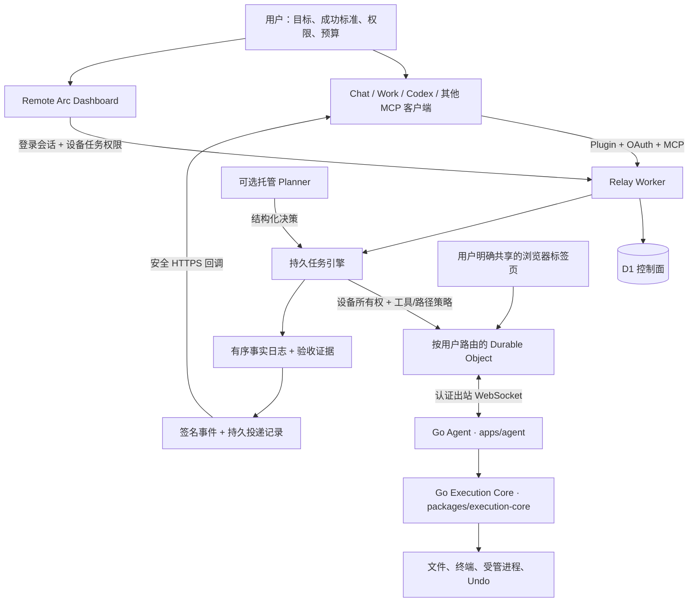
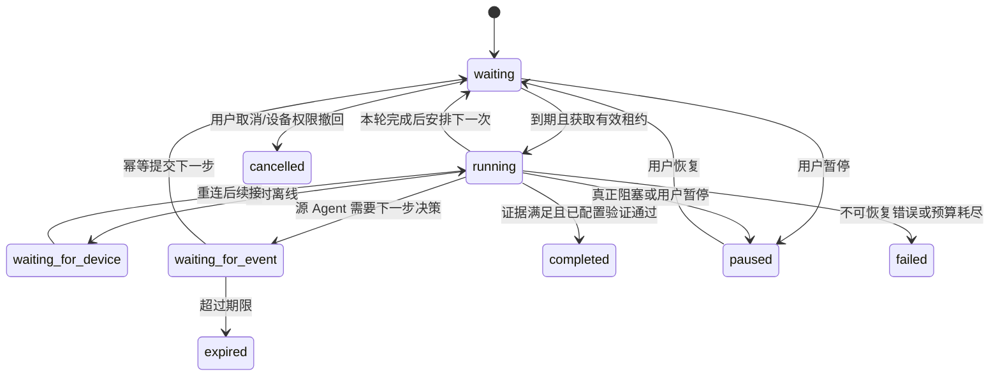

# Remote Arc 系统技术参考

**适用版本：Remote Arc 0.6.0 系列（2026-10-09 更新）。** 本文是工程架构参考，
不代表历史设计或实验功能均已正式上线。实际生产能力以
[官网 Docs](https://remotearc.app/docs)、[发行记录](https://remotearc.app/releases)
和安装的 Agent 版本为准。**[English technical reference](system-architecture.en.md)**。

早期 PR43/PR44 的开发阶段和 Draft 描述属于历史背景。Source Agent 的自适应续接、
MCP Events 唤醒、托管 Planner 和隔离执行器需明确区分设计、实验与已验收生产能力。
持久 Task 可以继续执行已经批准的确定性步骤，但不代表聊天结束后 AI 仍会持续推理。
实现与续接细节见 [PLAN.md](../PLAN.md) 和
[进度记录](long-running-work-progress.md)。

官网与代码一致性审查见 [官网内容审查](website-content-review.md)，当前执行边界及
未来可选隔离执行器的技术决策见 [执行隔离](execution-isolation.md)。后者是设计
建议，当前实现不包含 OS 沙箱。

## 1. 产品目标与系统职责

Remote Arc 将兼容 MCP 的 AI 客户端连接到用户自己的 Windows、macOS、Linux
电脑。用户保留设备、文件、进程及权限的控制权；设备通过出站连接接入托管
Relay，不需要公开设备端口或向客户端提供操作系统登录凭证。

系统既支持一次性读取、编辑和运行命令，也支持持久任务：用户提交有明确成功
标准的目标后，Agent 可以反复观察、决策、操作、检验和修正，持续数小时，
包括用户离开或睡觉期间。完成必须有证据；设置了验证命令的目标必须通过验证。

### 用户入口与 Task 的边界

用户的主要入口仍是 GPT/Work/Codex 的聊天。一次 `read_file`、`edit_block`
或普通命令调用不是持久 Task。Task 是需要跨多轮、等待断线恢复或未来触发的
工作记录，保存目标/执行计划、验收标准、设备、权限、预算、状态与结果。

用户用自然语言交代“继续修到测试通过”“今晚执行”“按这个间隔重复”等要求后，
AI 在已有授权内选择模式并调用创建工具；用户无需为每次操作去 Dashboard 填表。
Dashboard 是查看进度/证据、暂停/取消及预先管理设备能力的控制台，也提供手动
创建入口。普通即时请求直接使用工具，不为所有操作自动创建持久后台工作。

创建 Task、允许设备执行和维持源 Agent 推理是不同环节。设备能力未授权时，
AI 不能自行扩大权限。源控制器不能续接时，任务如实显示“等待 AI”，不能把
已保存目标宣称为仍在推理，也不能静默改用托管模型。已有授权不需要每轮重设。

三层实现责任：

| 层 | 职责 | 运行位置 |
| --- | --- | --- |
| 推理控制器 | 根据目标及观察结果选择下一步、总结事实、提出完成或阻塞 | Work/Codex/Chat 源 Agent，或显式选择的托管 Planner |
| 任务控制面 | 持久目标、调度、状态、日志、租约、恢复、验收及事件通知 | Cloudflare Worker + D1 |
| 设备执行面 | 在已授权设备上执行工具，管理进程、路径限制和 Undo | Go Agent + Execution Core |

Plugin/MCP 提供工具连接，不单独决定 AI 宿主的推理寿命。持续推理要由宿主的
长任务/目标模式，或经过验证的事件续接机制提供。Remote Arc 不会在源 Agent
停止后悄悄切换为其他模型。

## 2. 完整架构



代码目录：

| 目录/模块 | 责任 |
| --- | --- |
| `apps/relay/src/index.ts` | HTTP/OAuth/MCP/设备及调度入口 |
| `apps/relay/src/registry.ts` | 设备在线连接及工具路由 |
| `apps/relay/src/device-call.ts` | 设备所有权、当前工具策略及执行审计 |
| `apps/relay/src/automations.ts` | 持久任务创建、运行、恢复、验收及停止 |
| `apps/relay/src/automation-store.ts` | 租约/版本围栏、原子检查点、有序日志 |
| `apps/relay/src/source-goals.ts` | 源 Agent 上下文及幂等决策提交 |
| `apps/relay/src/agent-planner.ts` | 可选托管模型的结构化决策与错误分类 |
| `apps/relay/src/task-events.ts` | MCP Events、密钥保护、签名和有界重试 |
| `apps/relay/src/device-task-policy.ts` | 每台设备允许的任务能力 |
| `apps/relay/src/github-automation.ts` | 明确授权的 GitHub App 云端动作 |
| `packages/cli` | npm 安装与启动入口，默认 Go；`--ts` 选择兼容运行时 |
| `apps/agent` | Go 设备 Agent：配对、Relay 会话、日志、控制、登录恢复与任务检查点 |
| `packages/execution-core` | 独立 Go 模块：文件、进程、路径策略与 Undo，和 Agent 编译成一个二进制 |
| `apps/agent-ts` / `packages/execution-core-ts` | 显式 TS 回退与兼容/对照测试，默认设备链路不依赖它们 |
| `apps/ui` | 官网知识文档、配对、Dashboard、设备权限与任务管理 |

### 0.6.0 安装与执行边界

`npx remotelink@latest` 默认下载并校验匹配版本的原生 Go Agent；Node 只承担
npm 安装/启动入口。npx 路径会保留一个 Node 启动器转发标准 IO、退出码和信号；
Agent 与 Core 本身运行在 Go 进程中。直接下载和 Homebrew 运行 Go 二进制，
不需要 Node 或 Go 编译器。
官网 `/downloads`、GitHub release、npm 包及 Homebrew 配方共用一个版本号和
六平台 SHA256 清单。Go 内核和 Agent 是不同模块，但运行时没有新增 IPC。
云端 Relay、Dashboard 与共享 TS 协议仍使用 TypeScript。

升级或切换前先停止现有执行者，保持同一设备 ID、配对、权限与 Undo 格式。
Go 保留 `--go` 别名，npm 的 `--ts` 明确选择兼容实现；不自动接管活跃 TS
执行者，不静默退回 TS，也不重放已执行的命令。TS 背景服务和重启子进程
始终显式传入 `--ts`，避免默认入口变化导致恢复时误切引擎。

## 3. 能力矩阵

| 能力 | 行为 | 关键边界 |
| --- | --- | --- |
| 设备发现 | 返回账户拥有的电脑、在线状态及可用工具 | 不跨账户访问 |
| 文件操作 | 列目录、读取/检查、写入、精确替换 | 设备工具与路径策略 |
| Undo | 对受支持的文件修改创建与恢复本地快照 | 不是任意命令/第三方操作的回滚 |
| 终端/进程 | 启动命令、查询状态/输出、停止受管进程 | 真实本地用户权限；非通用 OS 沙箱 |
| 浏览器上下文 | 读取用户明确共享的标签页、选择文本、链接与表格 | 只读共享上下文；不声称通用 GUI 自动操作 |
| 进程恢复与登录自启（0.6.x 原生 Go） | launchd / Windows 用户级 supervisor / systemd-user 守护；单执行锁；终端可持续跟随日志；分别显示守护与 Relay 执行状态 | 与 Relay 网络重连独立；强杀执行者后约 15 秒接手；Windows 守护本身需持续运行；依赖用户登录和供电，旧运行实例需先停止或更新 |
| Long Task | 运行已批准命令并持续跟踪至退出 | 无独立动态推理 |
| Condition Watch | 匹配 Webhook 后执行确定计划 | 现有回调 URL 是 bearer capability |
| Schedule Watch | 未来时间或完成后固定间隔执行 | 非日历 cron / 时区 / DST 引擎 |
| Goal Loop | 重复固定计划及验证命令至达标 | 计划固定；不同于自适应 Agent |
| Hosted Agent Goal | 模型每轮根据结果重新选择已批准工具 | 明确选择的独立 Planner；非创建对话的同一模型保证 |
| Source Agent Goal | AI 宿主提交下一步，Remote Arc 执行与保存现场 | 宿主必须能继续运行或通过事件续接 |
| 任务期间保持唤醒 | 有时限、可续租的系统抑制休眠请求 | 设备及任务双重开启；不防断电、强制休眠或关盖 |
| GitHub 云端动作 | 安装级短期 token 执行明确指定 PR 合并 | 必须绑定账户/安装/仓库权限；未知结果不盲目重放 |

Agent Goal 当前可动态选择六种工具：`list_directory`、`read_file`、
`get_file_info`、`write_file`、`edit_block`、`start_process`。
进程状态、输出和停止由调度器管理。一次性 MCP 的工具面比 Agent Goal 更广。

## 4. 权限与按设备配置

四个条件同时成立才允许执行：账户/设备所有权、OAuth 或 Dashboard 授权、
设备任务权限、具体工具与路径策略。任务类型不是整台设备唯一的“运行模式”；
一台电脑可以允许多种任务，每个任务在创建时选择自己的类型。

Dashboard 的设备任务权限：

| 字段 | 作用 |
| --- | --- |
| `background_tasks` | 允许持久后台工作；关闭会停止本设备相关任务 |
| `scheduled_tasks` | 允许时间/间隔触发的任务 |
| `adaptive_agent` | 允许动态判断下一步的 Agent Goal |
| `source_agent` | 允许 AI 客户端通过续接协议推进目标 |
| `keep_awake` | 允许任务申请有界唤醒租约 |

现有设备没有保存新配置时，保留已授权的后台/定时/托管 Agent 行为；新增的
源 Agent 与唤醒能力默认关闭。配置损坏时关闭能力。设置能在线下保存，不需要
设备先在线；实际执行仍要求设备在线。关闭权限会使相关任务取消，阻止后续
副作用，并尝试停止当前受管进程。与已发出的操作有竞态时，迟到的进程句柄
会被清理；已产生的文件或第三方效果不能由取消自动撤销。

OAuth scope：`automation:read` 读取任务，`automation:write` 创建/管理持久任务，
`agent:write` 授权动态 Agent 工作。`computer:write` 本身不授予持久自主权限。
源决策同时要求 automation-write 与 agent-write；读取续接上下文要求 read。

创建任务会冻结工具集与路径安全策略。以后调整设备路径/工具策略时，旧任务
停止继续执行，不会继承扩大后的信任边界。设备任务开关单独重新检查，关闭
某项能力只停止受影响的任务。

## 5. 目标合同与生命周期

目标合同包含名称、设备、目标、成功标准、工作区、已批准工具、推理控制器、
验证命令（可选）、迭代上限、到期时间、触发方式以及运行上限。



`waiting_for_event` 通过 runtime phase 区分 Webhook 条件等待与源 Agent 的
`awaiting_agent`。暂时等待进程、网络或事件不需要一直进行模型推理。
达到迭代上限、到期、取消、权限变化或不可恢复错误时停止；不能把轮数耗尽
当成成功。

## 6. 源 Agent 续接协议

新增 MCP 工具保持旧工具名称及默认行为，源控制器为 opt-in：

1. `create_agent_goal(controller="source", ...)`：保存目标，不要求托管模型 key；
   设备必须允许源 Agent。由 MCP 创建时，绑定创建它的 OAuth client。
2. `get_goal_context(automation_id, after_sequence)`：读取合同、当前 revision、
   是否可提交、工作记忆、观察、进程、完成证据以及有序事实日志。
3. `submit_goal_decision(...)`：提交 `tool`、`complete` 或 `pause`，提供当前
   `expected_revision`、稳定 `idempotency_key`、简短决策摘要和事实记忆。
4. 调度器消费一项决策，通过设备边界执行，并保存新的观察；宿主继续读上下文
   或收到事件后再判断。出现旧 revision 时重新读取，不重复旧操作。

决策示例：

```json
{
  "automation_id": "task-id",
  "expected_revision": 5,
  "idempotency_key": "inspect-implementation-1",
  "decision": "tool",
  "tool": "read_file",
  "arguments_json": "{\"path\":\"/workspace/src/app.ts\",\"length\":120}",
  "decision_summary": "Read the implementation before changing it.",
  "memory": "The focused test fails; implementation not yet inspected.",
  "completion_evidence": ""
}
```

同一个 key 的相同 payload 可用于网络重试；不同 payload 复用 key 被拒绝。
同一个 revision 只接受一项决策。工作记忆是可交接事实，不能保存私有推理过程。
新的对话无需读取完整旧聊天就能从持久上下文继续。

## 7. Work、Codex 与 Chat

Work/Codex 的持续目标运行环境可以反复使用同一任务协议；Remote Arc 负责远端
电脑执行与恢复。Codex 的 `/plan` 负责方案，`/goal` 负责跨轮次推进目标，
具体功能、用量及运行寿命由宿主提供。

普通 Chat 可保存多阶段计划与确定性步骤。源轮次消失不删除任务，后续轮次通过
`get_goal_context` 读取有界事实续接。新的高层判断等待 `needs_reasoning`，已保存
且已授权的确定性步骤仍可继续。普通 Chat 自动唤醒需要经过验证的事件订阅：
用户请求后台工作及后续处理，宿主订阅任务事件，
Remote Arc 向宿主提供的 HTTPS 地址投递签名事件，宿主收到后按目标继续处理。
只连接 Plugin 不能证明 Chat 会整夜反复推理，也不能保证始终使用同一模型。

官方协议依据：

- [Goal 模式](https://learn.chatgpt.com/use-cases/follow-goals)
- [计划与目标](https://learn.chatgpt.com/docs/prompting)
- [长任务](https://learn.chatgpt.com/docs/long-running-work)
- [MCP Events](https://developers.openai.com/plugins/build/mcp-events)

真实 Chat/Work 整夜续接是独立验收项，不能用 mock Planner 或 2xx 回调代替。

## 8. MCP Events 与安全回调

在同一个已认证 `/mcp` endpoint 上支持 `server/discover`、`events/list`、
`events/subscribe`、`events/unsubscribe`。事件名为 `automation.updated`，
过滤器为任务 ID，只传递 revision、事件类型和简短状态摘要。

事件只用于 meaningful change：需要 Agent、完成、阻塞/暂停、失败、取消、到期
或结果不确定。后台进程还在运行等无变化检查不产生持续通知。

订阅绑定账户、OAuth client、任务和 callback；ID 确定生成，刷新幂等；有效期
最多 24 小时。签名 secret 必须符合 `whsec_` 格式，在 D1 使用 AES-GCM 加密。
callback 验证与正式投递使用 Standard Webhooks HMAC，签名覆盖事件 ID、时间戳
及精确 body；重试保留事件 ID，刷新签名时间，支持短暂的密钥轮换窗口。

部署前提：

- `MCP_EVENT_ENCRYPTION_KEY`：base64 编码的 32-byte 加密 key，以 Worker secret 保存。
- `MCP_EVENT_EGRESS`：安全 egress service binding；必须在连接时校验 DNS、固定公共
  目标地址并保持原 hostname 的 TLS 校验，拒绝私有地址和重定向。

Worker 不用普通 `fetch` 作为不安全回退。未配置两者时不宣告 Events 能力。
安全 egress service 的生产接入、宿主 callback 和实际 Chat 续接尚须单独验证。
此依赖不能被描述为已经在生产可用。

投递记录持久化并有租约；并发 Worker 不同时投递同一记录。2xx 只代表已收到，
不是 Agent 已工作或目标已完成。临时失败指数退避且最多六次；永久错误停止
订阅。撤回 OAuth 权限、暂停账户 MCP 或订阅过期会停止投递。协议不承诺历史
事件 replay；可通过任务上下文和日志恢复遗漏的事实。

## 9. 租约、检查点与中断恢复

每次任务写回检查 task ID、有效 lease token、lease expiry、活动状态、任务到期
以及单调 revision。旧 Worker 不能恢复已取消任务、清空新 Worker 租约，或把
旧结果覆盖到新状态。慢 Planner 返回后重新检查，执行前再次校验设备权限。

可能产生副作用的操作先保存 `action_intent`，得到结果后保存 `action_result`；
下一轮 Planner 前再保存最新观察。若中断发生在意图与确认之间，下次运行显示
结果未知，Agent 必须检查现状后决定，确定任务会停止而不是盲目重放。
这里不声称任意 shell 命令或第三方效果具有 exactly-once 语义。

已确认启动的受管进程丢失句柄时，Agent Goal 重新检查；确定任务沿用显式的
restart/fail 配置。restart 适合可重复命令；数据库迁移等不能安全重试的命令
应选择 fail。普通离线等待重连；模型 transport timeout、429、5xx 有界退避
重试，保留最近检查点。权限及无效输入错误不通过无限重试消耗资源。

## 10. 定时任务与电脑唤醒

Agent Goal 支持立即、未来时间和固定间隔触发；每次周期运行使用独立 run，
重置迭代、工作记忆和观察。相同任务不重叠运行。间隔从本轮完成开始计算，
不是墙钟 cron。时间是明确 ISO timestamp；时区/DST/错过运行的补偿策略尚未实现。

设备允许 `keep_awake` 后，任务还必须显式设置 `keep_awake=true`。Relay 为活动
任务续租，本地 CLI 通过 macOS `caffeinate`、Windows `SetThreadExecutionState`
或 Linux `systemd-inhibit` 申请短时抑制休眠。单个任务租约最多 180 秒；helper
本身也有硬期限。暂停/停止/完成、租约到期或断线后释放；不修改永久 OS 设置。

这不能替代供电、网络和登录状态，不能抵抗用户强制休眠、关机、断电或平台的
关盖策略。未来启动的任务需要设备当时可用，不自动从关机状态启动机器。
旧 CLI 没有唤醒工具时需更新本地 Agent，不能只开启云端开关便获得能力。

## 11. 验收、证据与报告

`complete` 决策须提供具体证据。配置了验证命令时，命令必须达到预期退出码；
失败返回给控制器继续修正。未配置验证命令时是 controller-attested completion，
并不等于独立验证全部成功标准。用户应为可自动检查的任务提供可靠验证命令。

任务上下文、run 的 output summary 和有序日志共同组成可读结果：目标、状态、
运行次数/迭代、最后观察、验收证据以及未解决的阻塞。事件摘要只通知变化，
完整事实通过 read 工具读取。真实过夜验收要求人离开后至少一次失败、适应、
复验和完成，早上可读到结果及证据。

## 12. 存储与隐私

| 存储 | 内容 |
| --- | --- |
| `devices` | 账户设备元数据、credential hash、工具/路径/任务权限与后台状态 |
| OAuth 表 | client、授权及 token hash、scope、期限及撤回状态 |
| `automations` | 冻结合同、trigger、state、事实记忆、受限观察、期限、租约及 revision |
| `automation_runs` | 每轮进程 ID、状态、退出码、错误及受限结果摘要 |
| `automation_journal` | 有序事实事件、revision、run ID、受限摘要；非私有推理 |
| `automation_decisions` | 幂等提交 hash 及等待消费的决策；消费后清除决策正文 |
| `automation_events/webhooks` | 条件事件标识、匹配/消费状态、callback secret hash |
| `task_event_subscriptions/deliveries` | callback、加密 signing secret、有效期及投递元数据 |
| 本地 Go Execution Core | 受管进程完整输出和文件 Undo 快照 |

持久 Agent Goal 的受限观察可能包含文件内容或进程输出，并会保存在控制面供
续接使用；不能把“未存完整原始输出”解释为“云端绝无任务内容”。这些观察也
会发给选定的托管 Planner，或返回已授权的源 Agent。待消费决策可能暂存写入
内容。已有隐私说明须与这一行为一致。

## 13. 部署、兼容与验收

PR55 在 PR44 上新增可选 Planned Agent Goal，正式技术参考见
[Chat-first Planned Goals](chat-first-planned-goals.md)，实施与续接路径见
[实施计划](chat-first-planned-goals-plan.md)。复用原有 D1 JSON 合同/状态、调度器、
账户设备、CAS/租约、日志、Events 与权限；没有新增 D1 迁移、OAuth Scope 或第二引擎。

多阶段计划包括 fixed/guided/autonomous、依赖门禁、阶段结果与两层事实记忆。
时间策略分别保存最少有效时间、最长时间、绝对停止时间与收尾预留。源轮次等待
仍保存期限检查，进程获得设备端有界计时；CLI 重启后丢失的进程仍须检查，不能
把这描述成重启持久 PID 管理。重复失败、缺乏进展与策略重试都有界；可搁置阻塞
阶段并推进独立且已授权阶段。自适应候选必须说明价值/风险/工作量/信心/验证，
并能放入剩余安全时间，不为了满足最少时间凑数修改。

配置 `green_only` 时，需要干净 Git 根目录及新版 CLI。任务在独立、脱离原分支
的 worktree 内执行，验收代码树在检查前后必须一致；必需检查全部通过才晋升
绿色版本。失败候选保留，恢复从已接受版本创建新 worktree，不 reset 用户原
分支，不自动应用成果。文件工具另加 canonical 任务目录约束，Shell 仍是本机
OS 用户权限，不能声称 OS 沙箱。受支持文件 Undo 与该任务 checkpoint 是不同
层：Undo 不回滚 Shell；任务 checkpoint 不回滚外部服务副作用。

`get_goal_context` 返回计划、当前阶段、时间、绿色版本、候选、检查、阻塞与下一
安全动作类。`needs_reasoning` 是持久 runtime phase，沿用等待事件状态；后续
源轮次依事实继续，无需完整聊天记录，也不静默切换 Planner。最终报告区分已
接受/未接受/部分完成/阻塞/未处理与未执行检查；`completed` 可能表示已收尾，
不能当成全部目标达标。Dashboard 在既有 Automations 内展示上述事实。

PR44 基于 PR43 的独立分支。新增 schema/API/tool 为 additive/opt-in，保留旧
工具名称、Hosted Planner 默认行为及确定任务模式。明确限制变化包括拒绝
旧 Worker 写入、禁止未知动作盲重放，以及 GitHub 动作必须拥有账户级仓库授权。
GitHub deployment-level installation ID 不是用户授权，需单独保存 permission。

验证分层：类型/构建检查；真实函数/SQLite 回归；本地 Wrangler/D1/假设备 E2E；
真实 Plugin OAuth、事件 callback、Work/Chat 和电脑的整夜验收。只有最后一层
才能证明用户睡觉期间真实 Agent 与电脑继续工作。

现有 release HOLD 延续：在 Plugin review / PR41 的发布决策完成之前，不合并、
不执行生产迁移/部署、不发布 npm、版本 tag 或 Plugin。官网新 Docs 与代码会
先在 Draft PR 预览中供审查。


## Unified task architecture follow-up (2026-10-05)

See [the task v2 contract](task-architecture-v2.md) for the new goal/command boundary, independent triggers, decision executors, scheduler heartbeat and compatibility migration. The five legacy automation kinds remain storage/API compatibility details. Dashboard natural-language objectives use a versioned goal contract and never become shell commands. New goals always have a finite plan time budget; source-only goals with no decision are visibly blocked. The checked-out Cron mismatch is fixed by registering the task Cron and dispatching on the existing monitor Cron as a fallback. Production deployment and real-host acceptance remain separate from local test results.
