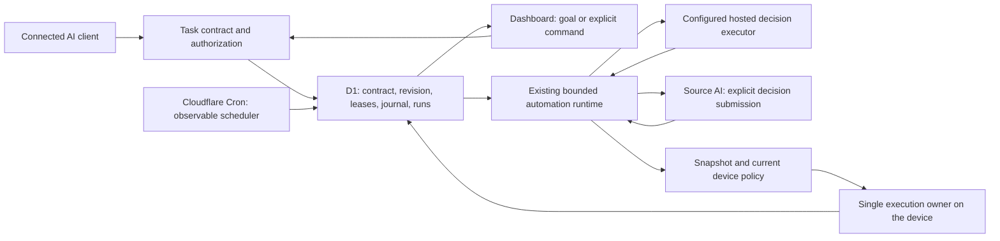

# Durable tasks: one objective, explicit execution, observable scheduling

Status: implemented with local acceptance passing on `feat/dashboard-task-device-ux`; production deployment and real overnight host acceptance remain pending. This document is the recovery checkpoint for the task redesign. It supersedes the five-mode Dashboard creation model; existing automation IDs and APIs remain compatible.

## Product contract

A goal task means: work towards a specific outcome, plan and revise within approved permissions, persist factual progress, and verify completion. A long duration, an overnight deadline, and a phase plan are properties of this task, not different products. A trigger determines when a run becomes eligible: now, at a time, at an interval, or after an event.

Creating a task must answer four questions before presenting it as runnable:

1. What result is wanted, and what evidence will count as success?
2. Which executor will make decisions after the user leaves?
3. Which device, workspace, tools and time/iteration limits are authorized?
4. When will it start, and is the scheduler actually healthy?

The Dashboard's primary creation flow is **Complete a goal**. A separate **Command automation** flow is for an explicitly supplied shell command or cloud action. Natural-language objectives are never converted to shell commands. Fixed retries and verification remain command automation settings; they are not AI planning.

## Evidence behind this redesign

The checked-out relay has a concrete configuration/handler mismatch: `wrangler.jsonc` registers only `*/5 * * * *`, while `index.ts` advances automations only for `* * * * *`. A successfully saved task can therefore remain due without ever being claimed. Correct code on a different branch is insufficient: the deployed worker, migrations, Cron configuration and client tool catalog must all match.

The user-provided record for `cb704194-bb7a-47dc-8585-8e4970d771ec` shows an ordinary command task containing the prose `帮我总结一下今天都干了什么` as its shell command, with no run records. This is external evidence, not an independent production database query from this branch. Restoring the scheduler alone would attempt to execute that sentence. Existing suspicious tasks must be inspected and cancelled/recreated with explicit user intent; do not guess their meaning or silently run a migrated plan.

The production MCP tools/list response retrieved on 2026-10-05 contains task tools and `start_process.cwd`, but this chat's installed tool catalog lacks them. A copied task reference retrieves saved authorized task state; it does not transfer the original conversation, grant permissions, or wake an idle ChatGPT session.

## Architecture

There is one task runtime, one lease mechanism and one persistent journal. Reuse `automations.ts`, `automation-store.ts`, planned goals and source decisions rather than adding a competing scheduler or task database. Introduce an explicit, versioned input contract above the existing storage model. Legacy `long_task`, `goal_loop`, `schedule_watch` and `condition_watch` values remain internal compatibility details. The public UI presents intent, trigger and execution responsibility independently.

### Execution responsibility

**Hosted AI** is the unattended goal executor. It requires an actually configured model provider and the account/device feature permissions. It reads observations and submits bounded actions through the existing runtime, which saves progress between turns. A browser tab and original chat need not remain open. Creation fails clearly when this executor is unavailable; it must never silently fall back to a source chat or shell command.

**Connected/source AI** owns reasoning in its own host. Remote Arc stores context, accepts revision-checked decisions, and can execute already approved deterministic slices. Without another decision, it waits for that AI. A source client can keep working only if its own runtime supports continued execution or a real event callback; ordinary ChatGPT conversation access alone does not provide this capability. Manual source goals are visibly awaiting a decision from creation, rather than counted as running work.

**Command automation** executes explicit saved commands, with optional bounded retries and verification. It needs no AI planner. The command input is prominently identified as code. New Dashboard submissions use a typed contract so a goal and a command cannot be accidentally interchanged. Legacy API compatibility cannot infer whether an arbitrary shell string is prose; retain explicit API semantics rather than unreliable language detection.

### Time, triggers and completion

Time budget and deadline bound a run; they are not promises to keep thinking until time is used up. A useful goal can complete early. Iteration limits, repeated-failure detection, phase outcomes, quality checks and a finalization reserve prevent endless or unproductive work. Recurring triggers start separate runs without overlapping a running goal. Interval recurrence must be described as an interval, not as a daily local-time schedule. Calendar schedules with IANA timezone and DST behavior require a distinct validated implementation before the UI can promise “every morning at 08:00”.

Persist objective, success criteria, plan revisions, observations, action identifiers, run start and finish, and completion evidence. A completed-round counter is not an execution-start counter. The UI shows actual run records and the current activity separately. The task reference must explicitly name the task-reading tool and report a missing tool instead of searching for a local checkpoint file.

### Scheduling and observability

Register the every-minute task Cron. Also advance tasks on the existing five-minute monitor Cron as a compatibility fallback; task leases fence overlapping invocations. Deliver pending task events independently even when a task tick fails. Save scheduler attempt/success metadata and expose a coarse health result plus the user's overdue count, with no other user's task data.

A due task with an unhealthy scheduler is shown as delayed by scheduling, not generically “waiting for the computer”. A scheduler heartbeat proves that the dispatcher ran; run records prove that a particular task started; verification evidence proves completion. These are separate claims.

Deployment acceptance must exercise the production scheduled handler, not only an admin test endpoint. The local integration test must invoke Cloudflare's scheduled-event simulation with the configured Cron and observe a saved task acquiring a run record.

### Recovery and safety

Device recovery is defined in [background-recovery.md](background-recovery.md). Enabling recovery keeps the terminal view open; an OS service/supervisor and an execution lease recover a lost execution owner. Relay reconnection handles transport loss separately. Automatic recovery never wakes a powered-off computer.

Cloud task leases and revision fencing prevent competing controllers from committing stale decisions. Unknown outcomes after a lost process handle require inspection rather than blind replay. Policy changes, revocation, pause, cancellation, expiry and explicit device stopping remain authoritative. Never broaden workspace or tools merely to complete a task. Record partial results and blockers honestly.

## Delivery and migration

1. Preserve existing work; fix the Cron mismatch and add scheduler health/migration.
2. Add a typed goal/command creation contract over the existing runtime. Validate executor, tools, trigger and bounds server-side. Preserve legacy MCP/API calls.
3. Replace five creation tabs with goal/command intent; expose triggers independently and make source-AI waiting explicit. Show saved instructions and actual run starts.
4. Test through the scheduled handler: immediate command, hosted goal, source awaiting decision, recurrence/event, offline recovery, pause/cancel, and unknown outcomes. Run the existing security and automation suites.
5. Update official product docs and client-catalog smoke checks. Create a Draft PR and verify its Cloudflare preview. Production publishing is a separate reviewable action.

Do not mass-migrate or resume existing production tasks. Preserve IDs, histories and original input, show legacy commands for inspection, and let the user explicitly replace wrongly created tasks. Mark implementation and deployment validation separately in the final handoff.

## MCP compatibility

`create_agent_goal` accepts additive `task_version: 1` and an independent `trigger`. It passes through the same typed contract as Dashboard, defaults to a bounded 24-hour plan and 720 reasoning turns, and requires explicit controller selection. Immediate source goals are ready for the first decision without inventing an execution record. Source goals remain bound to the authorizing OAuth client. Omitted version retains legacy hosted/30-turn/optional-plan behavior; mixing the new trigger with the legacy schedule is rejected. Webhook URLs are returned only on creation and remain secret capabilities. Actual MCP SDK dispatch is covered by `goal-continuation-test.mjs`.

## Implementation acceptance (2026-10-05)

The local Wrangler test exercises the actual scheduled handler using both registered Crons, the new D1 migration, typed command and hosted/source goals, planning and adaptation, exact planner metering, real run counts, event queue preservation across pause/resume, policy stop and offline recovery. MCP SDK dispatch covers version opt-in, legacy defaults, first source decision readiness and OAuth client binding. Scheduler tests cover unavailable, failed and stale dispatch metadata with account-scoped counts. UI preview covers both intents and all four triggers with read-only mock data.

Two bugs found during acceptance were fixed: resuming a queued webhook goal must retain its already consumed event; planned hosted decisions must meter successful planner turns just like legacy goals. See the UX checkpoint for full commands and deployment limits.
